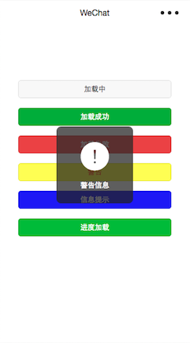
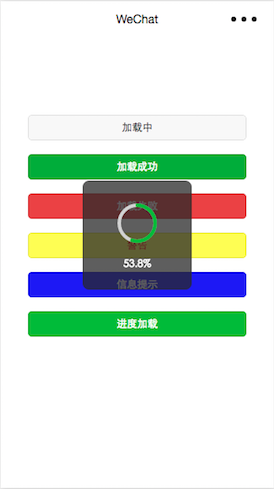

# wxHUD
微信小程序 HUD

## 如何使用

####1、导入hud文件夹到项目中
####2、app.js配置
	import hudClass from "?/hud/hud";
	let util = requir("?/utils/util.js");
	onLaunch: function () {
    	util.run();
    	this.util = util;
  	},
	
	hudClass: (s) => new hudClass(s),
####3、在需要使用的page页面的wxss中添加 
	@import "?/hud/hud.wxss";
####4、在需要使用的page页面的wxml中添加
	<import src="?/hud/hud.wxml" />
	<template is="isHUD" data="{{...hud.infos}}"/>
####5、在page的js中调用
	this.hud = app.hudClass(this).hud;//初始化
	this.hud.show(); // 默认显示加载，需主动调用隐藏hide();
	this.hud.showSuccess("加载成功"); // 成功并隐藏
	...
	// 进度条，加载完成后需手动调用hide()进行隐藏
	// value的范围0-100
	this.hud.showProgress(value, "进度信息"); 
	
具体使用请参考demo

感谢wux的支持 https://github.com/skyvow/wux